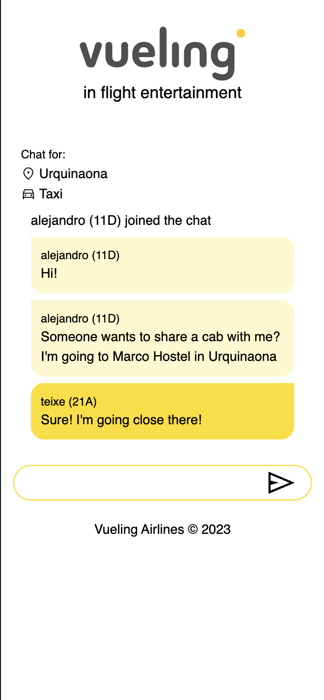

# Vueling, in flight entertainment - HackUPC 2023 submission

<p align="center">
  
</p>

Vueling's in-flight app that offers ChatRoulette, quizzes, ride-sharing chatrooms, and destination info. Enhance your travel experience today!

## Backend

ExpressJS app with Socket.io.

### To run the backend

```bash
cd backend/
npm i
npm run dev 
```

To change the listening port, change the following env variables:

- `APP_PORT`: to change the listening por of the HTTP API
- `SOCKET_PORT`: to change the listening por of the Socket.io API

## Frontend

NextJS frontend.

### To run the frontend

```bash
cd frontend/
npm i
npm run dev 
```

## Screenshots


<p align="center">
  
</p>

---

<p align="center">
  
</p>

---

<p align="center">
  
</p>

---

<p align="center">
  
</p>

---

<p align="center">
  
</p>

---

<p align="center">
  
</p>
